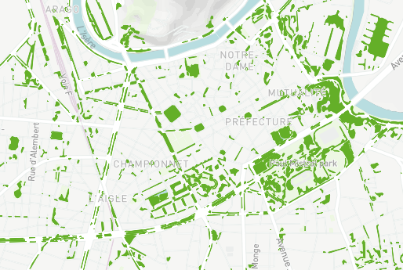
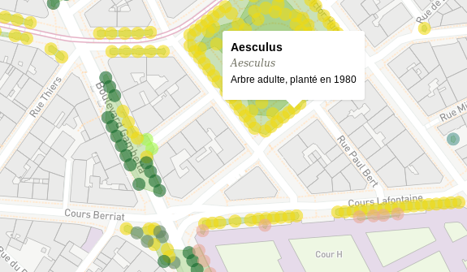

Title: Arbres de Grenoble
Slug: arbres2gre
Tags: visualisation, projet
Author: xdze2
Summary: Carte des arbres de la ville de Grenoble à partir des données en accès libre.
Date: 2017-12-29 11:00
Image: images/arbres2gre.png

# Arbres de Gre

[voir la carte ici](https://xdze2.github.io/arbres2gre/)

Captures d'écran:  

