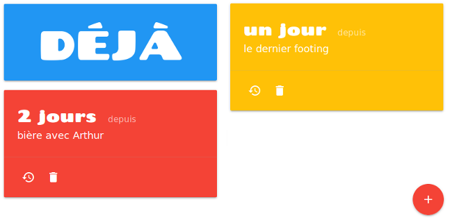

Title: Une todo liste inversée
Slug: deja
Tags: javascript, projet
Author: xdze2
Summary: pour voir le temps qui passe 
Date: 2017-05-9 11:00
Image: images/thumb_deja2.png

Une todo liste inversée...
pour voir le temps qui passe plutôt que le temps qui reste

En action ici: [https://xdze2.github.io/deja/](https://xdze2.github.io/deja/)

* Javascript, jQuery
* framework [Materializecss](http://materializecss.com/)
* Cookie
