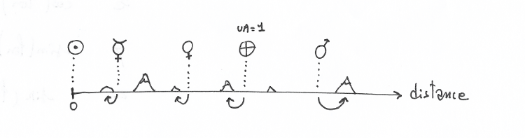
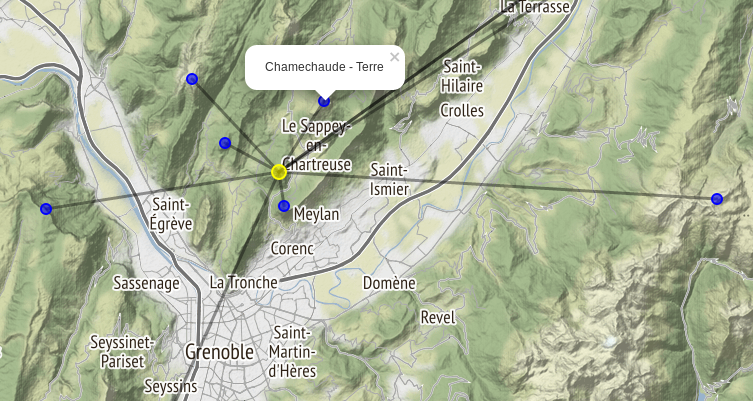

Title: Une planète au sommet
Slug: mountainsolarsystem
Tags: physique, projet, fun
Author: xdze2
Summary: Recherche systématique de montagnes pouvant former entre-elles un modèle du système solaire à l'échelle.
Date: 2017-12-12 11:00
Image: ./images/header_planetesommet.png

Recherche systématique des ensembles de sommets pouvant former entre-eux un système solaire à l'échelle.

Un exemple plutôt bien depuis l'Écoutoux (Chartreuse):

    Soleil : L'Écoutoux   diamètre: 4217 cm 

       Planète  Sommet                                   Erreur(%)   Distance(km)  Diamètre
    -----------------------------------------------------------------------------------------
       Mercure: Saint-Eynard (1359m)                        2.94       1.81         14.8 cm
         Vénus: Aiguille de Quaix (1143m)                   1.02       3.31         36.7 cm
         Terre: Chamechaude (2082m)                         0.00       4.53         38.6 cm
          Mars: Rochers de Chalves (1845m)                  0.33       6.89         20.5 cm
         Cérès: La Sure (1643m)                             1.34      12.71          3.0 cm
       Jupiter: Pic de l'apparence (2714m)                  0.03      23.58        423.7 cm
       Saturne: Sommet de Pierre Blanche (2108m)            2.41      44.29        353.0 cm
        Uranus: Aiguille du Grand Fond (2920m)              2.63      84.75        153.7 cm
       Neptune: Grandes Jorasses/ Pointe Walker (4208m)    14.63     117.75        149.2 cm
        Pluton: Grandes Jorasses/ Pointe Walker (4208m)    41.28     117.75          7.2 cm
        
        
        

Les notebooks sont ici [uneplaneteausommet.ipynb](https://github.com/xdze2/uneplaneteausommet).

Les sommets non visibles depuis le centre sont éliminés de la recherche. Le notebook [is_visible.ipynb](./is_visible.ipynb) explique le calcul (avec les données topographiques).

